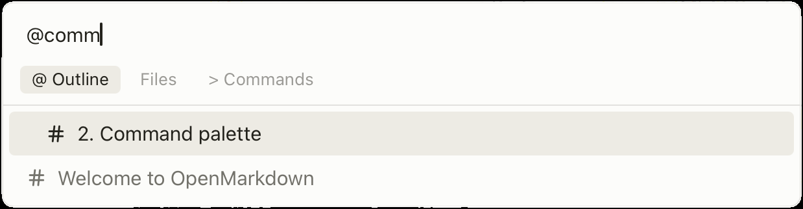

# Welcome to OpenMarkdown

This file is an onboarding tutorial. 
This is a `.md` file on your disk. OpenMarkdown just *renders* it. 

- First part: Basics — just you.
- Second part: Agents — you and your coding agent.

---

## 1. Markdown grammar + Live preview

Put your cursor anywhere and start editing.

### 1.1 Hash tag `#` for heading/subheading
#### 1.1.1 More `#`'s means subheading
##### 1.1.1.1 Six levels of heading in total 
###### 1.1.1.1.1 Fold/Expand heading  sections using the left triangle

**Bold** is double `**[TEXT]**` or `⌘B`
*Italic* is single `*[TEXT]*` or `⌘I`
~~Strikeout~~ is double `~~[TEXT]~~`

> [!tip]
> This is a **callout**. Change `[!tip]` to `[!warning]` and watch the color and
> icon change. (Callouts: `note` · `tip` · `important` · `warning` · `caution`.)
> Or `⌘⇧P`, type "callout" to insert one.

A table for planning the page. **Click a cell and edit it** — press `Tab` to move
across, `Enter` to add a row:

| Section | Content            | Done |
| ------- | ------------------ | ---- |
| Hero    | Big headline       |      |
| About   | One short sentence |      |
| Contact | An email link      |      |

**Note:** `⌘⇧P`, type "table" for table commands.

And a code block — your page's first lines. Syntax highlights automatically. Copy button on top right corner.

```html
<h1>Hi, I'm building this page</h1>
<p>...and OpenMarkdown is where I'm planning it.</p>
```

A **link** — ⌘-click to open: [openmarkdown.dev](https://openmarkdown.dev)
**Link another note** — type `[[`, pick a file, and it drops in as a link you can ⌘-click.
A **photo** — drag or copy any image into the note; it's saved next to this file and linked as ``.

That's the core feel: **you edit the file, the file is the truth, the app just
shows it.**

## 2. Command palette

> Command palette is the command center for
> - Find files
> - Jump to sections
> - Commands

Press `⌘P` — it opens on your **files**. With the box empty, tap `→` / `←` to cycle
the three modes: **files → `@` outline (jump to any heading) → `>` commands**.
(`⌘⇧P` jumps straight to commands.) Press `⌘/` any time to see every shortcut.

<!-- SCREENSHOT: ⌘P palette, empty query, three chips visible (files / @ outline / > commands) -->


## 3. Shortcuts

You may already know most of these. OpenMarkdown aims to feel as smooth as possible.

- `⌘S` — save · `⌘F` — find · `⌘/` — see every shortcut
- `⌘T` — new tab · `⌘⇧T` — reopen closed tab · `⌘W` — close tab *(don't, right now :)*
- `⌘1`–`⌘9` — jump to a tab · `⌥⌘←` / `⌥⌘→` — previous / next tab
- `⌥↑` / `⌥↓` — move a line · `⌥⇧↑` / `⌥⇧↓` — duplicate a line

## 4. The toolbar


<!-- SCREENSHOT: top toolbar — file/outline toggles on the left; palette, view-mode switch, settings, pin on the right -->

Top-left toggles the **file tree** and the **outline**. Top-right: the **command
palette**, the **view mode** (live / source / reading), **settings**, and **pin**
(keep the window always on top).

---

# OpenMarkdown Agent Experience

> [!WARNING]
>  No coding agent? You're all set. ▲
>
> Everything above works on its own. You now know enough to use OpenMarkdown for real.

## Agent Feature Showdown. ▼

> [!NOTE]
> - use Claude Code (or codex, Pi agent or any coding agents)
> - your agent can edit **this same file** alongside you
> - you both share one whiteboard.

To connect it:
1. **Settings → Command-line tool (openmd)**
2. **Settings → Connect your agent** — paste the line it gives you to your agent.

## Two ways to work together

**Ask it** *(you switch over)* — go to your agent's window and give it a prompt. It
edits *this* file; switch back to OpenMarkdown and watch the change land. Most sections
below work this way — each has a prompt to copy.

**Let it watch** *(it comes to you)* — tell your agent to *watch* this file (on Claude
Code: `/openmarkdown:co-edit`). Now you hand off work **without leaving OpenMarkdown**:
type `- [ ] @agent <task>` right in the file, save, and it does the work and ticks the
box. The last section tries this.

---

## Ask it: build the hero
*Shows: your agent writing into this file — you watch it appear.*

Copy this to your agent:

```
Write a punchy hero headline and a one-line subtitle into the
"Ask it: build the hero" section of this file.
```

<!-- your agent writes here — you'll see the text appear as it types -->

## Ask it: turn CSV into a table
*Shows: your agent reading what you highlight, then editing the file.*

A color palette as raw CSV. **Highlight it**, switch to your agent, and paste:

name,hex,use
ink,#1a1a2e,headings
sky,#4ea8de,links
paper,#f7f7f2,background

```
Turn the CSV I just highlighted into a markdown table.
```

## Ask it: punch up the copy
*Shows: your agent rewriting what you highlight.*

A rough draft of the page's intro. **Highlight it** and paste:

> Hi welcome to my website. It is a website that I made. Here you can find
> information about me and also how to contact me if you want to.

```
Rewrite the text I highlighted to be punchier — two short sentences.
```

## Ask it: jump me to a section
*Shows: reveal — your agent scrolls your view to a spot.*

Long note? Ask your agent (any heading works):

```
Take me to where we build the hero.
```

## Ask it: make a checklist
*Shows: you and your agent thinking together through a file — the whole point.*

Turn all of this into a plan you can act on:

```
List the steps to actually ship this web page as a checklist,
put it in a new file, and open it for me.
```

Then tick the boxes it made. Change your mind? Edit them and ask it to react — you're
working the same file from both sides.

## Let it watch: hand off a task
*Shows: the **live** mode — the agent watches this file; you hand off work inside it, no window switch.*

First, put your agent in watch mode:

```
Co-edit this file and pick up any @agent tasks I leave in it.
```

(On Claude Code, `/openmarkdown:co-edit` does this in one step.)

Now drop a task right into the file and save — it does the work and ticks the box.
Uncomment this (or write your own with `⌘⇧P` → *Insert @agent task*):

<!-- - [ ] @agent add a simple footer with a copyright line to the code block above -->

---

## Bonus: write your agent's prompts in OpenMarkdown
*Shows: `$VISUAL` / `$EDITOR` hand-off.*

In **Settings**, enable the **`$VISUAL` editor**. Then in your terminal (or Claude
Code) hit `⌃G` to compose your prompt here instead of the cramped input line —
`⌘↩` when you're done. Go back and forth as many times as you like.

---

## Come back any time
*This guide is just a file. Nothing to reinstall, nothing hidden.*

Reopen it whenever you want, three ways:

- **Command palette** (`⌘P`) → **Open Welcome guide**
- **Settings** → **Open Welcome guide**
- Or open the file directly: **`~/OpenMarkdown/Welcome.md`**

It lives on disk like any other note — feel free to edit it, keep notes in it, or
delete it. We'll never overwrite your changes.
